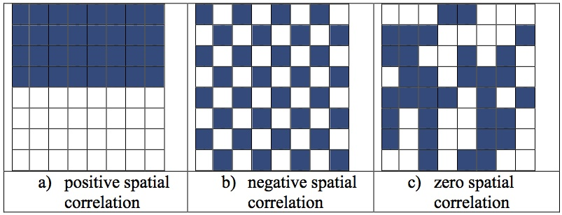

   
## Introdução

Esta análise busca investigar um método de cálculo de correlação espacial em R. Consideraremos as estatísticas de autocorrelação espacial global e como identificar agrupamentos espaciais em toda a nossa área de estudo.

A base deste trabalho é a Primeira Lei da Geografia de Tobler: "tudo está relacionado a tudo mais, mas as coisas próximas estão mais relacionadas do que as coisas distantes".

Assim, usando o conjunto de dados([Dados de Crime Polícia de Los Angeles](https://data.lacity.org/A-Safe-City/Crime-Data-from-2010-to-Present/y8tr-7khq){target="_top"}), veremos se o crime em Los Angeles([Analisado na Comunidade Kaggle](https://www.kaggle.com/cityofLA/crime-in-los-angeles){target="_top"}) é espacialmente autocorrelacionado e identificamos os clusers usando o LISA (Local Measure of Spatial Association).  

#### Autocorrelação Espacial
```{r imagem, echo = TRUE, out.width = '100%'}

# Exibindo imagem


```

#### Preparando o ambiente
```{r configuracao, echo = TRUE, warning = FALSE}
# Setando idioma e local da pasta de trabalho
Sys.setlocale("LC_ALL", "Portuguese_Brazil.1252")
setwd("E:/Outras Analises R/Crime-em-Los-Angeles")
 
# Instalando pacotes
pacotes <- c('tidyverse', 'classInt', 'maptools', 'rgdal', 'RColorBrewer', 'spdep', 'tmap')
local_lib <- "C:/PROGRA~1/R/R-3.6.0/library"
new.packages <- pacotes[!(pacotes %in% installed.packages()[,"Package"])] 
if(length(new.packages)) {
  install.packages(pacotes, dep = TRUE) 
}
 
# Importando bibliotecas
library(tidyverse)
library(classInt)
library(maptools)
library(rgdal)
library(tidyr)
library(RColorBrewer)
library(spdep)
library(plyr)
library(tmap)
```

#### Preparação dos dados
```{r dados, echo = TRUE, warning = FALSE}
# Importando Dados
districts <- readOGR(dsn = "./LAPD_Reporting_Districts.shp")
crime = read.csv("../Dados/Crime_Data_2010_2017.csv")
 
head(crime,5)
head(districts@data, 5)
```

Observando rapidamente os dados, podemos ver que o shapefile é composto de 1135 recursos diferentes. Isto corresponde ao distrito declarante em LA: crime$Reporting.District and districts@data$REPDIST.  

Usando as colunas comuns, podemos tentar mesclar os dados. Primeiro precisamos somar o número de crimes em cada distrito.

```{r echo = TRUE, warning = FALSE}
w <- table(crime$Reporting.District)
rep.dis <- as.data.frame(w)
length(unique(rep.dis$Var1))
head(rep.dis, 5)

```

Como podemos ver acima, o número de valores únicos não é igual ao número de recursos no shapefile, isto representa 0 crimes cometidos nesses distritos. Portanto, ao entrar, mantemos essas colunas usando "all.x = TRUE". Isso significa que mantemos todas as linhas de dados no shapefile. Estes retornam resultados de NA, por padrão, então mudamos isso com a segunda linha de código.

```{r echo = TRUE, warning = FALSE}
districts@data <- merge(districts@data, rep.dis, by.x = "REPDIST", by.y = "Var1", all.x = TRUE)
districts$Freq[is.na(districts$Freq)] <- 0
length(districts$Freq)
```

### Plotando Freqüência Criminal

```{r echo = TRUE, warning = FALSE}
var <- districts@data[,"Freq"]
breaks <- classIntervals(var, n = 9, style = "fisher")
my_colours <- rev(brewer.pal(9, "RdBu"))
plot(districts, col = my_colours[findInterval(var, breaks$brks, all.inside = TRUE)],   
       axes = FALSE, border = NA)
legend(x = -118.7, y = 34, legend = leglabs(breaks$brks), fill = my_colours, bty = "n", cex = 0.6)
```

Uma rápida visão geral da trama mostra a maioria dos distritos com menores contagens de crimes denunciados. Existem casos esporádicos de altas contagens, especialmente em áreas ao norte, o que poderia sugerir uma autocorrelação espacial próxima a zero, representando a aleatoriedade na distribuição espacial dos dados.

Uma medida melhor seria as taxas de criminalidade, no entanto, a população por distritos reportados não está disponível.

### Autocorrelação Espacial
Em vez de especular usando o gráfico, vamos tentar quantificar a correlação. A autocorrelação espacial mede como a distância influencia uma variável específica, neste caso a freqüência do crime em um distrito.  

Usando a primeira lei de geografia de Tobler, esperamos que a maioria dos fenômenos geográficos exerça uma autocorrelação espacial de algum tipo. Este é frequentemente o caso em dados com fatores humanos, já que pessoas de características similares tendem a residir em vizinhanças semelhantes devido a uma variedade de razões, incluindo preços de casas, proximidade a locais de trabalho e fatores culturais.  

A autocorrelação espacial pode ser representada de duas maneiras: global ou localmente. O modelo global cria uma medida individual representando todo o conjunto de dados, enquanto os modelos locais nos permitem explorar o agrupamento espacial em toda a área de LA.  

Primeiro temos que atribuir neibourghs a cada um dos distritos. Existem 2 métodos para fazer isso: Rook ou Queen. Podemos traçar as ligações entre os distritos vizinhos para visualizar sua distribuição no espaço.

```{r echo = TRUE, warning = FALSE}
neighbours <- poly2nb(districts)
neighbours
plot(districts, border = 'lightgrey')
plot(neighbours, coordinates(districts), add=TRUE, col='red')
```


```{r echo = TRUE, warning = FALSE}
neighbours2 <- poly2nb(districts, queen = FALSE)
neighbours2
plot(districts, border = 'lightgrey')
plot(neighbours, coordinates(districts), add=TRUE, col='blue')
plot(neighbours2, coordinates(districts), add=TRUE, col='red')
```

Podemos ver que o segundo método (Rook) retorna muito menos links e podemos interpretar visualmente a diferença.  

### Autocorrelação Espacial Global

Agora que temos vizinhos, precisamos convertê-los.

Então podemos executar o teste de um moran. Isso cria um valor de correlação entre -1 e 1, a distribuição espacial desses valores é vista na figura da Introdução. 1 representa autocorrelação espacial positiva perfeita, 0 mostra que os dados são distribuídos aleatoriamente e -1 é autocorrelação espacial negativa.

```{r echo = TRUE, warning = FALSE}

listw <- nb2listw(neighbours)
listw
moran.test(districts$Freq, listw)

```

A estatística Global Moran I é de 0,085, mostrando que a frequência de crimes em cada distrito é distribuída de forma significativamente aleatória. No entanto, vamos dar uma olhada nisso e ver se a autocorrelação espacial local retorna um resultado similar.  

### Autocorrelação Espacial Local
Em primeiro lugar, criamos um gráfico moran olhando para cada um dos valores plotados em relação aos seus valores espacialmente defasados. Explora a relação entre os dados e seus vizinhos.

```{r echo = TRUE, warning = FALSE}
moran <- moran.plot(districts$Freq, listw = nb2listw(neighbours2, style = "W"))
```

A partir do gráfico de dispersão, sugere potencialmente que a frequência dos crimes de cada distrito seja aleatória. Vamos tentar mapeá-lo.

```{r echo = TRUE, warning = FALSE}
local <- localmoran(x = districts$Freq, listw = nb2listw(neighbours2, style = "W"))
moran.map <- cbind(districts, local)
tm_shape(moran.map) + tm_fill(col = "Ii", style = "quantile", title = "local moran statistic")
```

Um valor positivo indica que o distrito é cercado por distritos de valor semelhante.

Do mapa, podemos ver que, em grande parte, nos distritos de LA, não há relação entre o número de crimes de um distrito e o de um distrito vizinho. No entanto, podemos ver alguns grupos de alta similaridade nos distritos do norte. Embora, não seja possível interpretar se estes são grupos de alta contagem de crimes ou baixos, apenas que são semelhantes. Então, nós conduzimos um mapa de cluster LISA.

### LISA

```{r echo = TRUE, warning = FALSE}
quadrant <- vector(mode="numeric",length=nrow(local))
 
# Centraliza a variável de interesse em torno de sua média
m.crime <- districts$Freq - mean(districts$Freq)     
 
# Centraliza Moran´s local em torno da média
m.local <- local[,1] - mean(local[,1])    
 
# Limiar de significância
signif <- 0.1 
 
# Constrói um quadrante de dados
quadrant[m.crime >0 & m.local>0] <- 4  
quadrant[m.crime <0 & m.local<0] <- 1      
quadrant[m.crime <0 & m.local>0] <- 2
quadrant[m.crime >0 & m.local<0] <- 3
quadrant[local[,5]>signif] <- 0   
 
brks <- c(0,1,2,3,4)
colors <- c("white","blue",rgb(0,0,1,alpha=0.4),rgb(1,0,0,alpha=0.4),"red")
 
plot(districts,border="lightgray",col=colors[findInterval(quadrant,brks,all.inside=FALSE)])
box()
legend(x = -118.7, y = 34,legend=c("insignificant","low-low","low-high","high-low","high-high"),
       fill=colors,bty="n")
```

## Conclusão

Como podemos ver no mapa, que o aglomerado, identificado no mapa anterior do moran, eram distritos de altas contagens de crimes relatados cercados por outros distritos de altos relatórios de crimes. Surpreendentemente, 2 das variáveis do cluster não estão presentes: distritos de baixa frequência do crime cercados por distritos similares de baixa incidência de crimes (azul escuro) e distritos de alta criminalidade cercados por distritos de baixa frequência criminal. 

## Disponibilidade dos dados
O conjunto de dados bem como o código R e arquivos auxiliares utilizados nesta análise podem ser encontrados em: [https://github.com/erivandoramos/Crime-em-Los-Angeles](https://github.com/erivandoramos/Crime-em-Los-Angeles){target="_top"}

## Referências

Ambarish Ganguly. **Little Book on Data Visualization and Modelling**. Disponível em: <[https://ambarishg.github.io/books/LittleBookDataViz](https://ambarishg.github.io/books/LittleBookDataViz){target="_top"}> Acesso em: 22 mai. 2019. 
